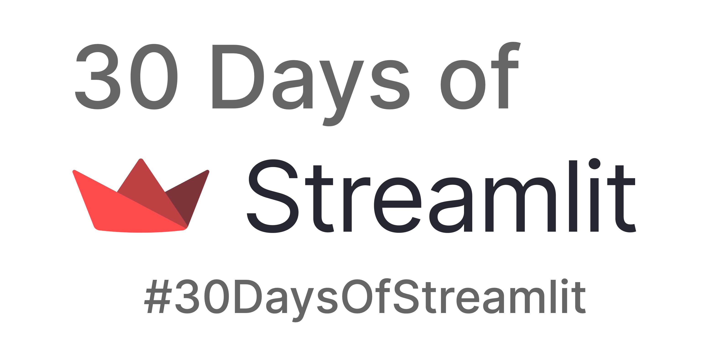

# ৩০ দিনে স্ট্রিমলিট্   🎈

এটি হল #30DaysOfStreamlit-এর প্রধান রেপো — আপনার জন্য স্ট্রিমলিট্ অ্যাপগুলি শিখতে, তৈরি করতে এবং স্থাপন করার জন্য একটি 30-দিনের সামাজিক চ্যালেঞ্জ৷

## কিভাবে অংশগ্রহণ করবেন

অংশগ্রহণ করার জন্য আপনার যা দরকার তা হল একটি কম্পিউটার, পাইথন সম্পর্কে একটি প্রাথমিক ধারণা এবং আপনার কৌতূহল। 🧠

স্ট্রিমলিটের [টুইটার](https://twitter.com/streamlit) এবং [লিঙ্কডইন](https://www.linkedin.com/company/streamlit/posts/?feedView=all) অ্যাকাউন্টের পাশাপাশি [`#30DaysOfStreamlit` app](https://share.streamlit.io/streamlit/30days/) মাধ্যমে প্রতিদিন একটি নতুন চ্যালেঞ্জ প্রকাশিত হয়।

প্রতিদিনের চ্যালেঞ্জগুলি সম্পূর্ণ করুন, টুইটার বা লিঙ্কডইনে আমাদের সাথে আপনার সমাধানগুলি ভাগ করুন এবং স্ট্রিমলিট দ্বারা পুরস্কৃত হোন! 😎

## দৈনন্দিন চ্যালেঞ্জ কি?

অংশগ্রহণ করে নির্দিষ্ট চ্যালেঞ্জ সম্পর্কে আরও জানুন! ৩০-দিনের চ্যালেঞ্জগুলি সমস্ত দক্ষতা স্তরের অংশগ্রহণকারীদের কাছে আবেদন করার জন্য ৩ স্তর দ্বারা বিভক্ত:

| প্রাথমিক (দিন ১-৭) | মধ্যবর্তী (দিন ৮-২৩) | উন্নত (দিন ২৪-৩০) |
| :---        |    :----   |          :--- |
| আপনার স্থানীয় এবং ক্লাউড কোডিং পরিবেশ সেট আপ করুন, স্ট্রিমলিট্ ইনস্টল করুন এবং আপনার প্রথম স্ট্রিমলিট্ অ্যাপ তৈরি করুন। | প্রতিদিন একটি নতুন [স্ট্রিমলিট্](https://docs.streamlit.io/library/api-reference) কমান্ড সম্পর্কে জানুন এবং একটি সাধারণ স্ট্রিমলিট্ অ্যাপ তৈরি এবং স্থাপন করতে এটি ব্যবহার করুন। | সেশন স্টেট, দক্ষ ডেটা এবং ক্যাশিং, জটিল নকশা এবং আরও অনেক কিছুর মাধ্যমে মেমরি ব্যবস্থাপনার মতো গুরুত্বপূর্ণ বিষয় সম্পর্কে জানুন।

## পুরস্কার

ডেটা অ্যাপ তৈরির দ্রুততম এবং সহজতম উপায়ে দ্রুত গতিতে উঠা যদি ইতিমধ্যেই সেরা গ্রীষ্মকালীন উপহার না হয়, তাহলে আপনি স্ট্রিমলিট গুডিও জিততে পারেন!

প্রতিদিনের চ্যালেঞ্জগুলি সম্পূর্ণ করুন, [টুইটার](https://twitter.com/streamlit) বা [লিঙ্কডইন](https://www.linkedin.com/company/streamlit/posts/?feedView=all) আমাদের সাথে আপনার সমাধানগুলি ভাগ করুন এবং দুর্দান্ত স্ট্রিমলিট সোয়াগ দিয়ে পুরস্কৃত হোন!

## সম্পদ

- অফিসিয়াল [`#30DaysOfStreamlit` app](https://share.streamlit.io/streamlit/30days/) অ্যাপ যেখানে প্রতিদিনের চ্যালেঞ্জ পোস্ট করা হয়
- প্রতিদিনের আপডেটের জন্য আমাদের [টুইটার](https://twitter.com/streamlit) এবং [লিঙ্কডইন](https://www.linkedin.com/company/streamlit/posts/?feedView=all) ফিড
- স্ট্রিমলিট্ কমান্ডের পুঙ্খানুপুঙ্খ রেফারেন্সের জন্য স্ট্রিমলিট্ [ডকুমেন্টেশন](https://docs.streamlit.io/) এবং [চিট শীট](https://docs.streamlit.io/library/cheatsheet)
- অনুপ্রেরণা, টেমপ্লেট এবং সম্প্রদায়ের অ্যাপের জন্য আমাদের দুর্দান্ত [গ্যালারি](https://streamlit.io/gallery)
- টিপস এবং সর্বশেষ স্ট্রিমলিট্ তথ্যের জন্য আমাদের [ব্লগ](https://blog.streamlit.io/how-to-master-streamlit-for-data-science/)
 
## অনুবাদ

#30DaysOfStreamlit এর নাগাল প্রসারিত করতে আমাদের সাহায্য করতে চান এবং ইংরেজি আপনার প্রাথমিক ভাষা নয়? চ্যালেঞ্জগুলিকে আপনার পছন্দের ভাষায় অনুবাদ করুন এবং নীচে তাদের লিঙ্ক করুন!

- [ইংরেজি](https://github.com/streamlit/30days) (আধিকারিক): 
- [চাইনিজ](https://github.com/TeddyHuang-00/30days-Chinese) ([নান হুয়াং](https://github.com/TeddyHuang-00)) দ্বারা: 
- [স্প্যানিশ](https://github.com/streamlit/30days-spanish/) ([এমিলিয়ানো রোসো](https://github.com/arraydude)) দ্বারা: 
- [ফরাসি](https://github.com/streamlit/30days-French) ([চার্লি ওয়ার্গিনার](https://github.com/charlyWargnier/)) দ্বারা: 
- [পোলিশ](https://github.com/streamlit/30days-polish) ([মাইকেল নোবটকা](https://github.com/sfc-gh-mnowotka)) দ্বারা: 
- [পর্তুগীজ](https://github.com/franciscoed/30days) ([ফ্রান্সিস্কো এডিল্টন](https://github.com/franciscoed)) দ্বারা: 
- [রাশিয়ান](https://github.com/kseniaanske/30days) ([কেসিনিয়া আনসকে](https://github.com/kseniaanske)) দ্বারা: 
- [হিন্দি](https://github.com/streamlit/30days-Hindi): 
